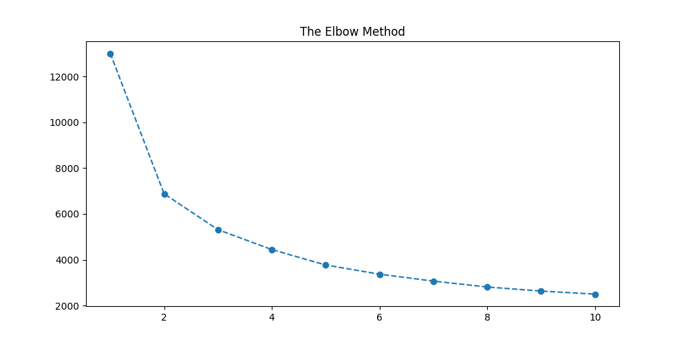
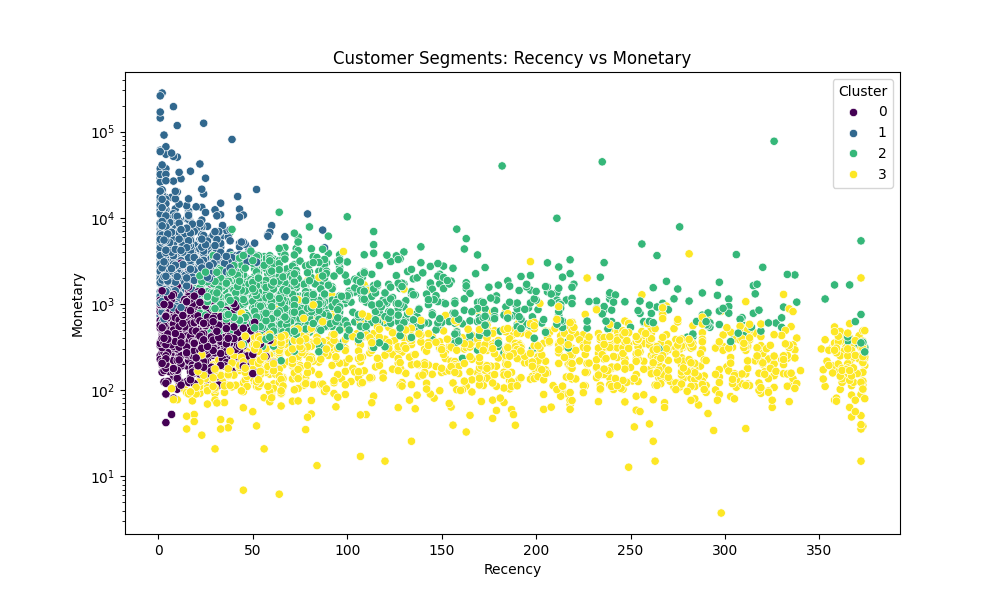
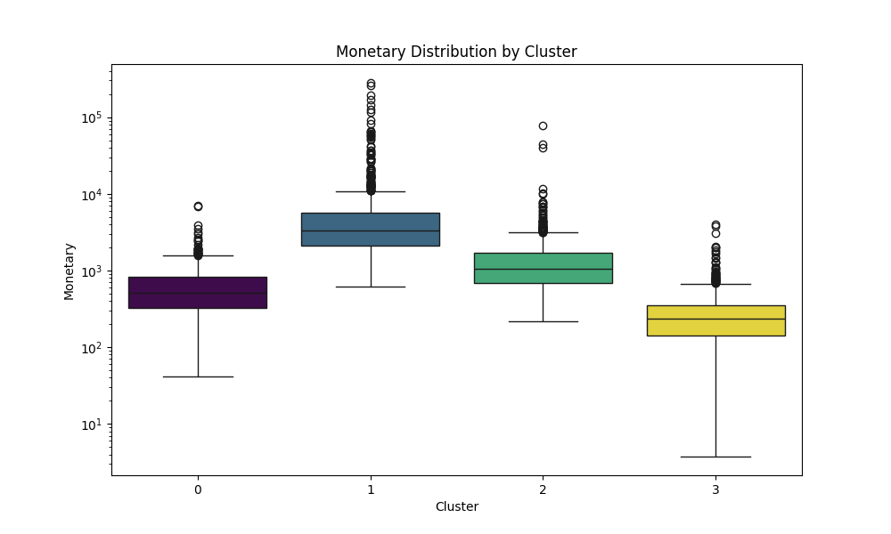

# 📊 E-Commerce Customer Segmentation: RFM & K-Means
> **Leveraging Machine Learning to drive targeted marketing strategies for a UK-based retailer.**

## 📋 Project Overview
This project analyzes a transactional dataset from a UK-based online retail store. The goal is to move beyond "one-size-fits-all" marketing by segmenting over **4,000 customers** into distinct behavioral groups using **RFM (Recency, Frequency, Monetary)** analysis and **K-Means Clustering**.

## 🛠️ The Technical Workflow
1. **Data Cleaning:** Processed 500k+ rows, handling missing values and filtering out transaction returns to ensure data integrity.
2. **Feature Engineering:** Built an RFM table from scratch, calculating Recency, Frequency, and Monetary value for each customer.
3. **Pre-processing:** Applied **Log Transformation** to handle heavy right-skewness and **StandardScaler** to normalize features for distance-based clustering.
4. **Optimal K Discovery:** Utilized the **Elbow Method** to identify the optimal number of segments (K=4).

## 🚀 Business Insights & Segments
Using the K-Means algorithm, the customer base was divided into 4 actionable personas:

| Segment | Profile | Marketing Strategy |
| :--- | :--- | :--- |
| **Champions** | High spenders, very recent, frequent. | Loyalty programs, early access to new arrivals. |
| **Loyalists** | Shop often but at lower price points. | Upsell bundles to increase Average Order Value (AOV). |
| **At-Risk** | High-value customers who haven't shopped lately. | Aggressive "Win-back" discounts and personalized outreach. |
| **Hibernating** | Low spenders, high recency, low frequency. | Automated re-engagement with minimal budget spend. |

## 📈 Key Findings
- **Variance Analysis:** The **Box Plot** revealed that while 'Champions' have the highest median spend, they also show the most variance—suggesting a sub-group of "Super-Whales" that may require bespoke VIP management.
- **Revenue Leakage:** Identified a significant 'At-Risk' group that contributed a large portion of historical revenue but has not returned in several months.

## 🧰 Tech Stack
- **Language:** Python
- **Libraries:** Pandas, NumPy, Scikit-Learn, Matplotlib, Seaborn
- **Environment:** Google Colab
